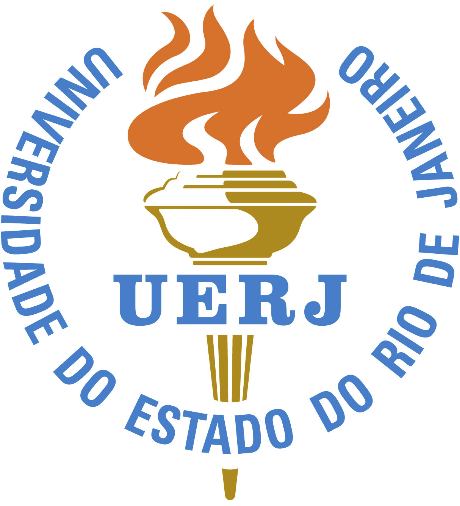

 &nbsp; &nbsp;  

**LaTeX-UERJ** é um repositório que disponibiliza um pacote LaTeX (classe e template) para redigir teses, dissertações e monografias (em português e inglês) segundo as normas de apresentação da Universidade do Estado do Rio de Janeiro (UERJ).

Esse pacote LaTeX e os templates nele inclusos foram depurados e adaptados pelo nosso grupo de pesquisa, estão sendo disponibilizados aqui com o desejo que sejam úteis às novas gerações de alunos. Entretanto, esse pacote não tem nenhuma garantia de funcionalidade. Use-o por sua conta e risco!

## Template

**LaTeX-UERJ** possui alguns templates para formatar teses, dissertações e monografias (em português e inglês), você pode usar esses modelos para começar o seu documento acadêmico. Adaptações e melhoramentos são encorajados.

## Autores
Esse pacote foi desenvolvido por diferentes gerações de alunos e docentes da UERJ. A versão aqui disponibilizada teve contribuições dos seguintes autores:
- Americo Cunha
- Luís Fernando de Oliveira
- 

## Licença

**LaTeX-UERJ** é distribuído segundo os termos da licença GNU General Public License v3.0. Veja o arquivo LICENSE para mais detalhes. Todas as novas contribuições devem ser feitas sob a licença GNU General Public License v3.0.
